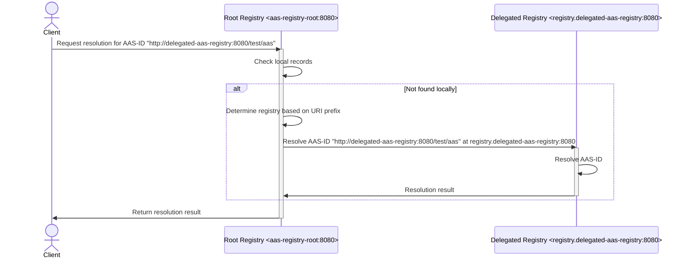

# AssetAdministrationShell Registry - Hierarchy - Example

This example showcases the working principle of the hierarchical registries feature.

## Scenario description

## Running the scenario

In order to run the example, please make sure that all aasregistries maven modules are correctly installed in your local Maven repository.

1. Generate the Docker image: `mvn clean install -Ddocker.namespace=aas-registry-test`

2. Run the docker compose: `docker compose up`

Two containers should start: (1) one for the root AAS Registry - to which the http request are going to be made; (2) one for the delegated AAS Registry - to which requests may be delegated to.

They are visibile within the bridged Docker network as (1) aas-registry-root:8080 and (2) registry.delegated-aas-registry:8080

3. Run the scenario [HierarchicalAasRegistryIT](/src/test/java/org/eclipse/digitaltwin/basyx/aasregistry/feature/hierarchy/example/HierachicalAasRegistryIT.java)
