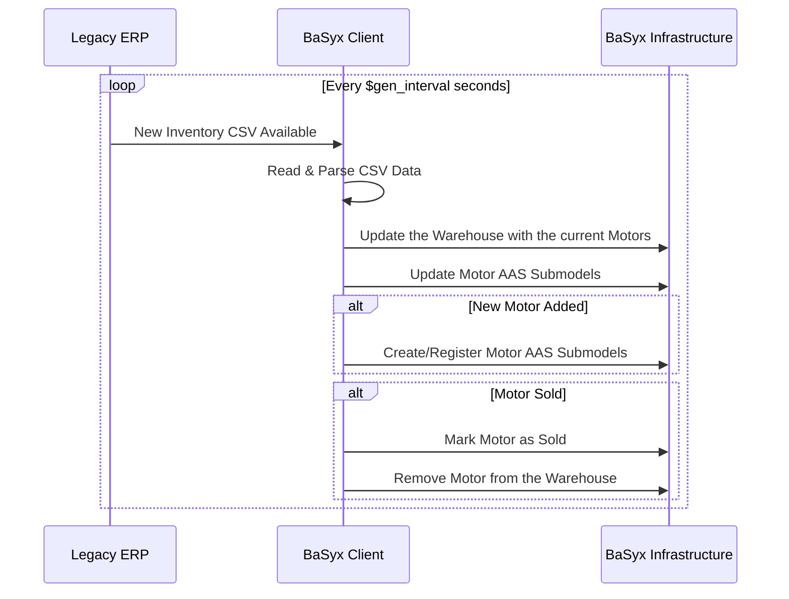

# BaSyx Client Example



This use case demonstrates an integration between a **legacy ERP system** and the **BaSyx** infrastructure. The ERP system, simulated by a Python application, periodically exports warehouse inventory data in the form of CSV files. These CSV exports contain key details about motors in stock, under maintenance, or sold.

The **BaSyx Client** serves as an adapter application that interfaces between the legacy ERP and BaSyx's registry and repository servers. The client uses the **BaSyx Java Client libraries** to perform the following operations:

- **Ingest Inventory Data:** The BaSyx Client monitors the CSV exports from the ERP. When a new CSV file is generated, the client reads and parses the inventory data.
- **Create and Register Motors:** The client creates and registers the **AASs** and **submodels** in the **BaSyx infrastructure**
- **Update Motors:** The client updates the Motors' **submodels** in the **BaSyx infrastructure**, reflecting their current status (in stock, under maintenance, sold).
- **Update Warehouse:** The client updates the Warehouse **AAS** with the motors currently stored in it.
- **Lifecycle Management:** Motors marked as "Sold" remain in the system but are no longer updated or maintained. Their status is reflected in the AAS submodels.

## Running the example

To run the example containers, you need to have Docker installed on your device.

1. Open a terminal in this folder
2. Run the following command to start the BaSyx containers:

```sh
docker-compose up -d
```

### Endpoints

- AAS Environment: [http://localhost:8081](http://localhost:8081)
- AAS Registry: [http://localhost:8082](http://localhost:8082)
- Submodel Registry: [http://localhost:8083](http://localhost:8083)
- AAS Web GUI: [http://localhost:3000](http://localhost:3000) 

### How to use

1. Open the AAS Web GUI at [http://localhost:3000](http://localhost:3000)
2. Observe motors being added and updated based on incoming exports from the `legacy-erp` service (visible in the folder ./ingest).
3. In the Warehouse AAS you will find an overview of the motors currently stored