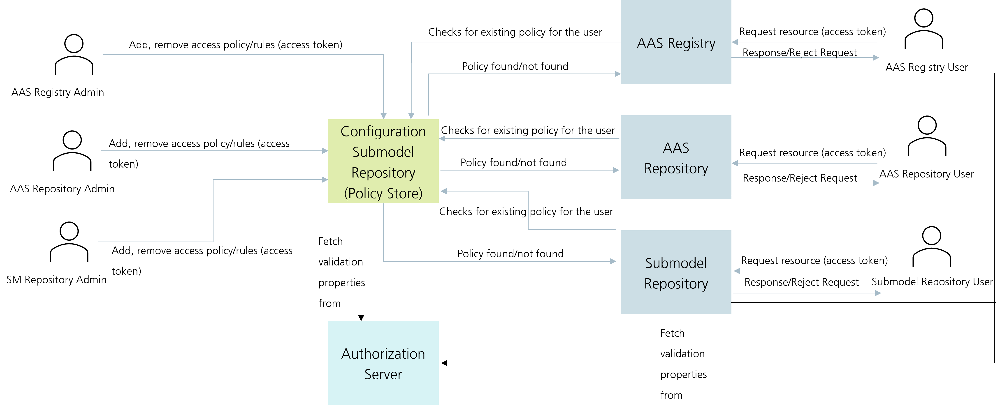
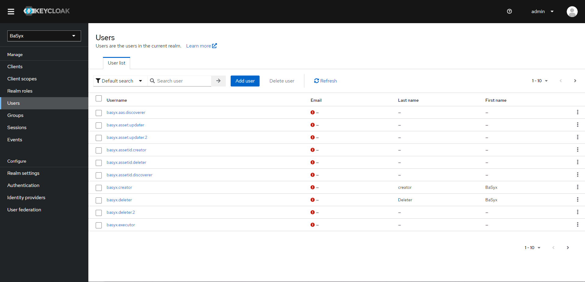
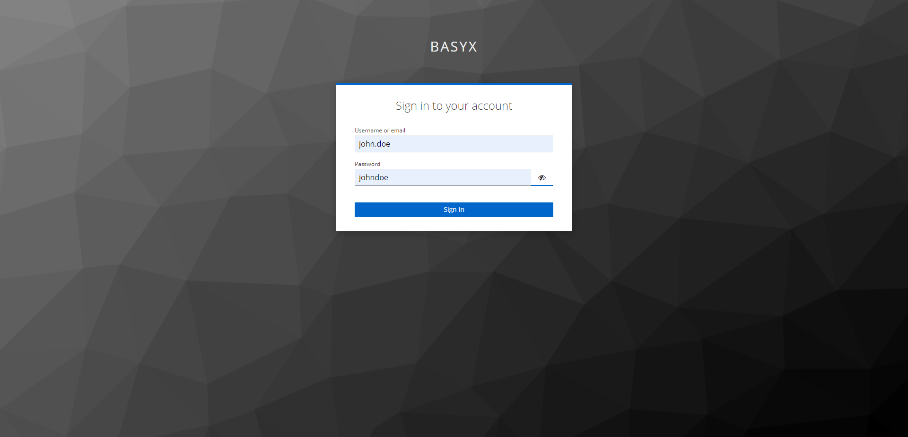
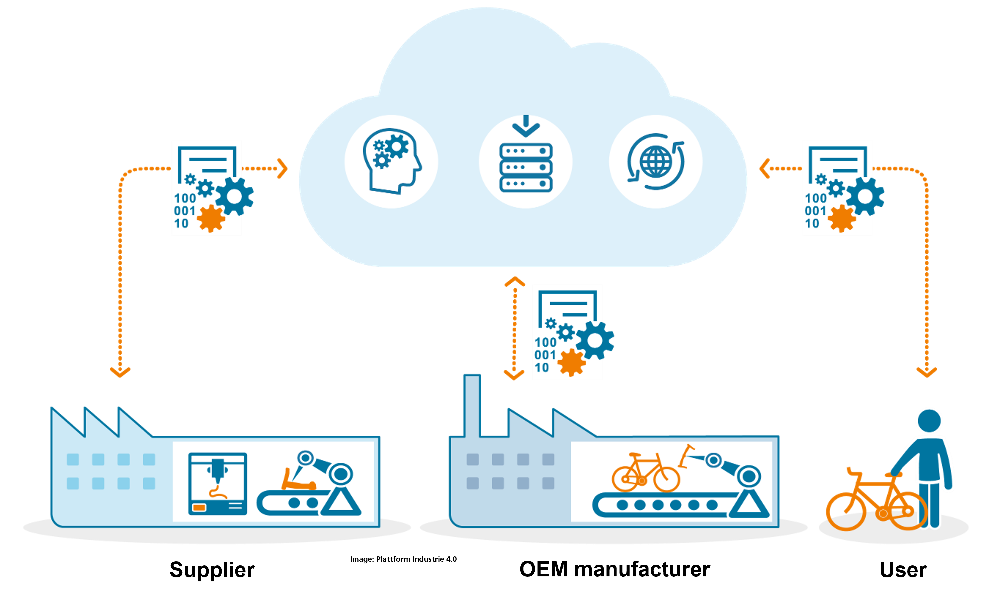
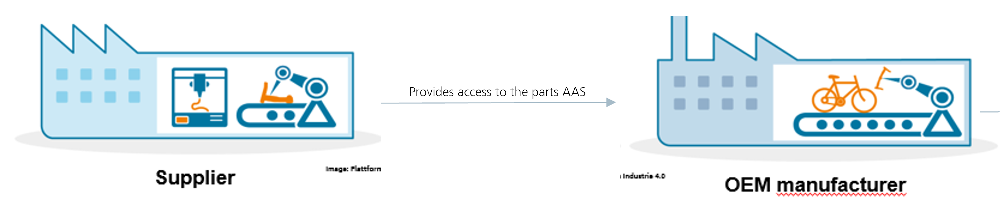

# BaSyx Dynamic RBAC Management

* BaSyx supports dynamic management of RBAC rules using a security Submodel.
* The administrator of the system controls the policy/access rules inside the Submodel.
* Rules can be added or deleted during the system's runtime.



## Prerequisites
1. REST API Client (e.g., [Postman](https://www.postman.com/downloads/))
2. Import the [Postman Collection](DynamicRBAC.postman_collection.json)
3. Docker

To start the secure setup execute the following command

```bash
docker-compose up -d
```

This will start the BaSyx components and the Keycloak server. The Keycloak server can be found at http://localhost:9097.
There you can login as admin with username `admin` and password `keycloak-admin`.



The example comes with an already configured realm `BaSyx` and a user `john.doe` with password `johndoe`.
This user has the `admin` role and can access all BaSyx components and all information about each component.

The entry point for accessing the Asset Administration Shells and their Submodels is the AAS Web UI running at http://localhost:3000.
After opening the page you will be redirected to the Keycloak login page. Use the credentials of user `john.doe` to log in.



## Security in BaSyx

Detailed documentation of BaSyx Security is available inside Authorization section of each component [here](https://wiki.basyx.org/en/latest/content/user_documentation/basyx_components/v2/index.html)

For e.g., AAS Repository authorization is documented [here](https://wiki.basyx.org/en/latest/content/user_documentation/basyx_components/v2/aas_repository/features/authorization.html)

Following shows how a JSON based RBAC rule looks like a Submodel-based rule:

#### Example of a Simple RBAC Rule
```json
{
  "role": "admin",
  "action": "READ",
  "targetInformation": {
    "@type": "aas",
    "aasIds": "*"
  }
}
```

#### Example of a Simple Submodel persistent RBAC Rule
```json
{
  "modelType": "SubmodelElementCollection",
  "idShort": "YWRtaW5SRUFEb3JnLmVjbGlwc2UuZGlnaXRhbHR3aW4uYmFzeXguYWFzcmVwb3NpdG9yeS5mZWF0dXJlLmF1dGhvcml6YXRpb24uQWFzVGFyZ2V0SW5mb3JtYXRpb24=",
  "value": [
      {
          "modelType": "Property",
          "value": "admin",
          "idShort": "role"
      },
      {
          "modelType": "SubmodelElementList",
          "idShort": "action",
          "orderRelevant": true,
          "value": [
              {
                  "modelType": "Property",
                  "value": "READ"
              }
          ]
      },
      {
          "modelType": "SubmodelElementCollection",
          "idShort": "targetInformation",
          "value": [
              {
                  "modelType": "SubmodelElementList",
                  "idShort": "aasIds",
                  "orderRelevant": true,
                  "value": [
                      {
                          "modelType": "Property",
                          "value": "*"
                      }
                  ]
              },
              {
                  "modelType": "Property",
                  "value": "aas",
                  "idShort": "@type"
              }
          ]
      }
  ]
}
```

## Example use case

* A bicycle manufacturer and suppliers of parts of bicycle works collaboratively.
* There is one Manufacturer and two Suppliers.
* Two suppliers are for Gear and Frame.
* Following are the information for access rules configuration in Identity Management:

| Role               | User  | Password |
|--------------------|-------|----------|
| FrameSupplier      | alice | alice    |
| GearSupplier       | bob   | bob      |
| ManufacturerFrame  | dave  | dave     |
| ManufacturerGear   | dave  | dave     |




### View Rules for this example

* Postman -> AASDataspace -> Rules -> Frame (In Postman collection)
* Open any request
* Go to body and check the structure of rules

### Formula for generating idShort of the RBAC rule for the Rule SubmodelElementCollection

* The idShort of the RBAC rule for the Rule SubmodelElementCollection is the Base64 encode of the concatenation of **Role** + **Action** + **TargetInformation Class**.
* For e.g., Role = admin, Action = DELETE, TargetInformation Class = org.eclipse.digitaltwin.basyx.aasrepository.feature.authorization.AasTargetInformation. The idShort will be Base64(adminDELETEorg.eclipse.digitaltwin.basyx.aasrepository.feature.authorization.AasTargetInformation) which is YWRtaW5ERUxFVEVvcmcuZWNsaXBzZS5kaWdpdGFsdHdpbi5iYXN5eC5hYXNyZXBvc2l0b3J5LmZlYXR1cmUuYXV0aG9yaXphdGlvbi5BYXNUYXJnZXRJbmZvcm1hdGlvbg==.

Similarly, you can create idShorts using the below TargetInformation class as per the TargetInformation in consideration.

| Component                         |                                         TargetInformation Class                                                                     |
|-----------------------------------|-------------------------------------------------------------------------------------------------------------------------------------|
| AAS Environment                   | org.eclipse.digitaltwin.basyx.aasenvironment.feature.authorization.AasEnvironmentTargetInformation                                  |
| AAS Repository                    | org.eclipse.digitaltwin.basyx.aasrepository.feature.authorization.AasTargetInformation                                           |
| Submodel Repository               | org.eclipse.digitaltwin.basyx.submodelservice.feature.authorization.SubmodelTargetInformation                                 |
| Concept Description Repository    | org.eclipse.digitaltwin.basyx.conceptdescriptionrepository.feature.authorization.ConceptDescriptionTargetInformation                |
| AAS Registry                      | org.eclipse.digitaltwin.basyx.aasregistry.feature.authorization.AasRegistryTargetInformation                                        |
| Submodel Registry                 | org.eclipse.digitaltwin.basyx.submodelregistry.feature.authorization.SubmodelRegistryTargetInformation                              |
| AAS Discovery                     | org.eclipse.digitaltwin.basyx.aasdiscoveryservice.feature.authorization.AasDiscoveryServiceTargetInformation                        |

### Scenario



* When Frame Supplier delivers the product they also add a policy/rule (using Dynamic RBAC) so that the manufacturer can see the Digital Twin of the supplied product.
  - Postman -> AASDataspace -> Rules -> Frame (In Postman collection)
    - We need to add rules separately for AAS/SM Registry as well as AAS/SM Repository
    - Before providing the access
      - Postman -> AASDataspace -> Rules -> Manufacturer
      - Go to GET_FrameAAS request or GET_SupplierSMFrom_FrameAAS -> Authorization -> Get New Access Token (at very bottom) -> Use Token
      - Send the request
      - These requests will return 403
    - Add rules to provide access
      - Postman -> AASDataspace -> Rules -> Frame
      - For each requests -> Authorization -> Get New Access Token (at very bottom) -> Use Token
      - Send each requests
      - These requests will return 201 indicating a new rule has been added to the Security Submodel using Dynamic RBAC Management
    - Now retry accessing the resource as a Manufacturer
      - Postman -> AASDataspace -> Rules -> Manufacturer
      - Go to GET_FrameAAS request or GET_SupplierSMFrom_FrameAAS -> Authorization -> Get New Access Token (at very bottom) -> Use Token
      - Send the request
      - These requests will return 200 OK


* Similarly, when Gear Supplier delivers the product they also add a policy/rule (using Dynamic RBAC) so that the manufacturer can see the Digital Twin of the supplied product.
  - Postman -> AASDataspace -> Rules -> Gear (In Postman collection)
    - We need to add rules separately for AAS/SM Registry as well as AAS/SM Repository
    - Before providing the access
      - Postman -> AASDataspace -> Rules -> Manufacturer
      - Go to GET_GearAAS request or GET_SupplierSMFrom_GearAAS -> Authorization -> Get New Access Token (at very bottom) -> Use Token
      - Send the request
      - These requests will return 403
    - Add rules to provide access
      - Postman -> AASDataspace -> Rules -> Gear
      - For each requests -> Authorization -> Get New Access Token (at very bottom) -> Use Token
      - Send each requests
      - These requests will return 201 indicating a new rule has been added to the Security Submodel using Dynamic RBAC Management
    - Now retry accessing the resource as a Manufacturer
      - Postman -> AASDataspace -> Rules -> Manufacturer
      - Go to GET_GearAAS request or GET_SupplierSMFrom_GearAAS -> Authorization -> Get New Access Token (at very bottom) -> Use Token
      - Send the request
      - These requests will return 200 OK
