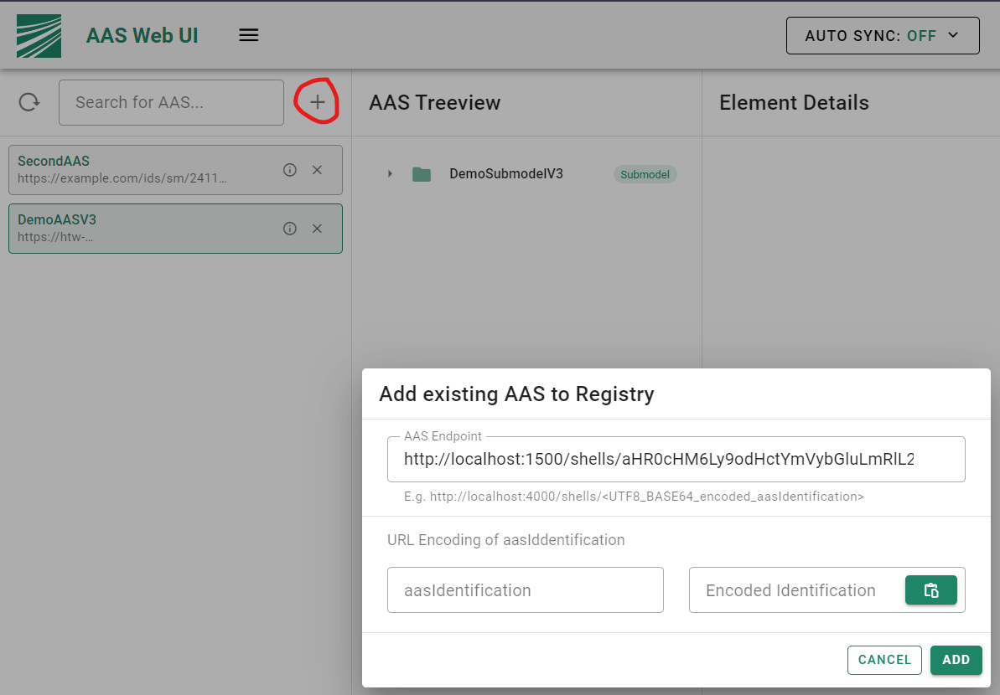

# BaSyx V2 NGINX Example

This folder contains example configurations and a docker compose file for setting up the BaSyx V2 infrastructure with nginx.

After executing 

```bash
docker-compose up -d
```

the following components are started:
* AAS Repository (http://localhost/aas-repo)
* Submodel Repository (http://localhost/submodel-repo)
* ConceptDescription Repository (http://localhost/cd-repo)
* AAS Registry (http://localhost/registry)
* AAS Web UI (http://localhost/aasui)


As of right now you have to register all Asset Administration Shells on your own (possible through the UI).

You can use the following endpoints to register Asset Administration Shells which are included in the example:

```bash
http://localhost/aas-repo/aHR0cHM6Ly9hY3BsdC5vcmcvVGVzdF9Bc3NldEFkbWluaXN0cmF0aW9uU2hlbGw=
```

```bash
http://localhost/aas-repo/aHR0cHM6Ly9hY3BsdC5vcmcvVGVzdF9Bc3NldEFkbWluaXN0cmF0aW9uU2hlbGxfTWFuZGF0b3J5
```

```bash
http://localhost/aas-repo/aHR0cHM6Ly9hY3BsdC5vcmcvVGVzdF9Bc3NldEFkbWluaXN0cmF0aW9uU2hlbGwyX01hbmRhdG9yeQ==
```

```bash
http://localhost/aas-repo/aHR0cHM6Ly9hY3BsdC5vcmcvVGVzdF9Bc3NldEFkbWluaXN0cmF0aW9uU2hlbGxfTWlzc2luZw==
```


