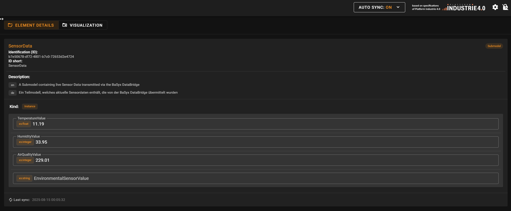
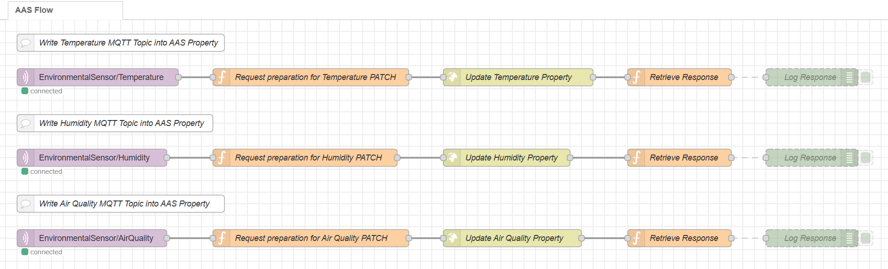

# BaSyx Node-RED Example

This example showcases the integration of BaSyx with Node-RED for seamless data flow and management in industrial IoT applications.
Here, an example MQTT client for an environmental sensor is used to send data via Node-RED to the BaSyx AAS Environment.

## How to run the BaSyx + Node-RED Example

1. Open a terminal in this folder
2. Run the following command to start the BaSyx containers:

```bash
docker-compose up -d
```

> To run the example containers, you need to have Docker installed on your device.

## View the working Example

To see the working example, open the [BaSyx AAS Web UI](http://localhost:3000) and navigate to the `SensorExampleAAS`. You can see the data coming from the MQTT client in the `SensorData` submodel.
To see updates in real-time, active the `Auto-Sync` feature in the AAS Web UI (see top right corner of the UI).



## Where to find the configuration

### Node-RED

You can visit the [Node-RED Editor](http://localhost:1880) to view and edit the flows.

> The preconfigured Node-RED flow can be found in the `nodered` folder. The flow is defined in the `flows.json` file.



### MQTT Client

The configuration for the MQTT client can be found in the `mqtt-client` folder. It is a small Python script that publishes data to the MQTT broker.

### MQTT Broker

The MQTT brokers configuration can be found in the `mosquitto` folder. The configuration is defined in the `config/mosquitto.conf` file.

### BaSyx Components

The configuration for the BaSyx components can be found in the `basyx` folder.
The AAS used in this example is located in the `aas` folder.
