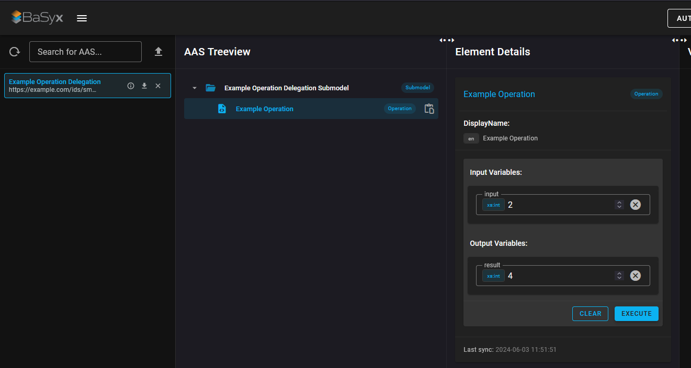

# BaSyx Operation Delegation Example Setup
To run the example containers, you need to have Docker installed on your device.

## How to start the example containers
1. Open a terminal in this folder
2. Run the following command to start the BaSyx containers:
```
docker-compose up -d
```

## Access the BaSyx containers
- AAS Environment: [http://localhost:8081](http://localhost:8081)
- AAS Registry: [http://localhost:8082](http://localhost:8082)
- Submodel Registry: [http://localhost:8083](http://localhost:8083)
- AAS Web GUI: [http://localhost:3000](http://localhost:3000) 
- Delegated Operation Service [http://localhost:8087](http://localhost:8087) 

## How to use
1. Open the AAS Web GUI

2. Open the Operation
3. Enter a value and execute