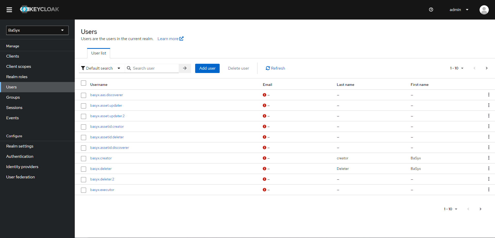
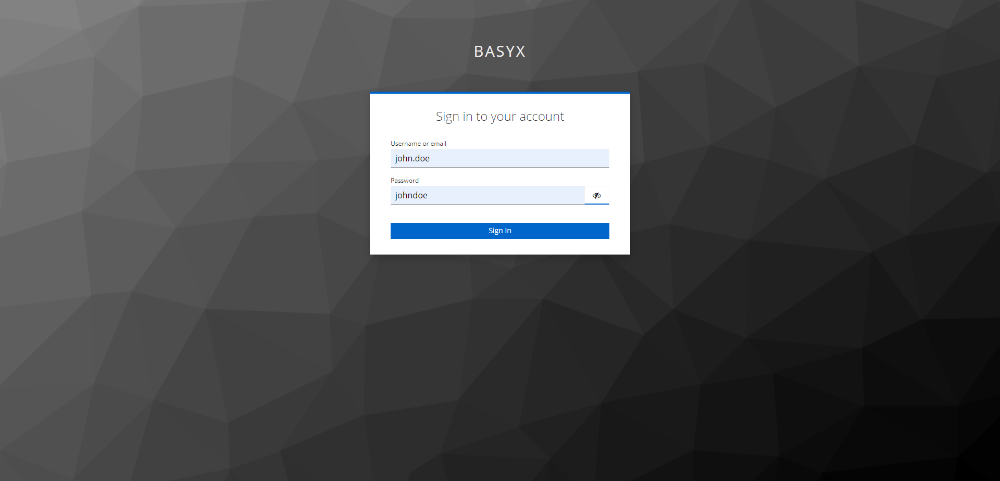
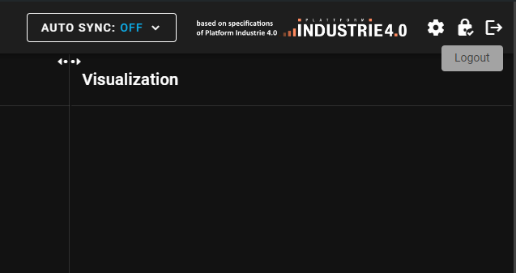

# BaSyx Secure Setup

All BaSyx components support role-based access control by using Keycloak as identity provider.
Access rules are defined based on roles. Roles are defined in the Keycloak server.

To start the secure setup execute the following command

```bash
docker-compose up -d
```

This will start the BaSyx components and the Keycloak server. The Keycloak server can be found at http://localhost:9097.
There you can login as admin with username `admin` and password `keycloak-admin`.


The example comes with an already configured realm `BaSyx` and a user `john.doe` with password `johndoe`.
This user has the `admin` role and can access all BaSyx components and all information about each component.

The entry point for accessing the Asset Administration Shells and their Submodels is the AAS Web UI running at http://localhost:3000.
After opening the page you will be redirected to the Keycloak login page. Use the credentials of user `john.doe` to log in.


From there you can access the AAS and Submodels of the BaSyx components.
The UI shows the login status in the top right corner.
To end your session click on the logout button in the top right corner.


There are several other user accounts available, each with different roles. You can use them to test the different levels of access. The password for these users is their username without the dots. You can find them in the [Users](http://localhost:9097/admin/master/console/#/BaSyx/users) tab of the BaSyx realm in Keycloak.