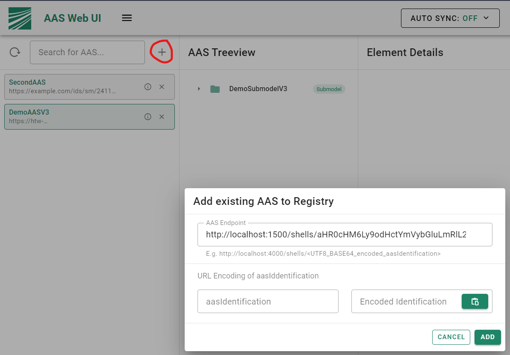

# BaSyx V2 Examples
This folder contains example configurations and docker compose files for setting up the BaSyx V2 infrastructure.

## Simple Example

After executing 

```bash
docker-compose up -d
```

the following components are started:
* AAS Repository (http://localhost:8081/shells)
* Submodel Repository (http://localhost:8081/submodels)
* ConceptDescription Repository (http://localhost:8081/concept-descriptions)
* AAS Registry (http://localhost:8082/api/v3.0/shell-descriptors)
* AAS Web UI (http://localhost:3000)


As of right now you have to register all Asset Administration Shells on your own (possible through the UI).

You can use the following endpoints to register Asset Administration Shells which are included in the usage example:

```bash
http://localhost:8081/shells/aHR0cHM6Ly9odHctYmVybGluLmRlL2lkcy9hYXMvZGVtb2Fhc3Yz
```

```bash
http://localhost:8081/shells/aHR0cHM6Ly9leGFtcGxlLmNvbS9pZHMvc20vMjQxMV83MTYwXzAxMzJfNDUyMw==
```



The example project includes some more shells to try out which include SubmodelElements that have currently no frontend representation. Here, a provisional visualization is shown.

```bash
http://localhost:8081/shells/aHR0cHM6Ly9hY3BsdC5vcmcvVGVzdF9Bc3NldEFkbWluaXN0cmF0aW9uU2hlbGw=
```

```bash
http://localhost:8081/shells/aHR0cHM6Ly9hY3BsdC5vcmcvVGVzdF9Bc3NldEFkbWluaXN0cmF0aW9uU2hlbGxfTWFuZGF0b3J5
```

```bash
http://localhost:8081/shells/aHR0cHM6Ly9hY3BsdC5vcmcvVGVzdF9Bc3NldEFkbWluaXN0cmF0aW9uU2hlbGwyX01hbmRhdG9yeQ==
```

```bash
http://localhost:8081/shells/aHR0cHM6Ly9hY3BsdC5vcmcvVGVzdF9Bc3NldEFkbWluaXN0cmF0aW9uU2hlbGxfTWlzc2luZw==
```

## BaSyx with NGINX
See the separate [NGINX example](BaSyxNGINX) for a comprehensive setup leveraging NGINX.
